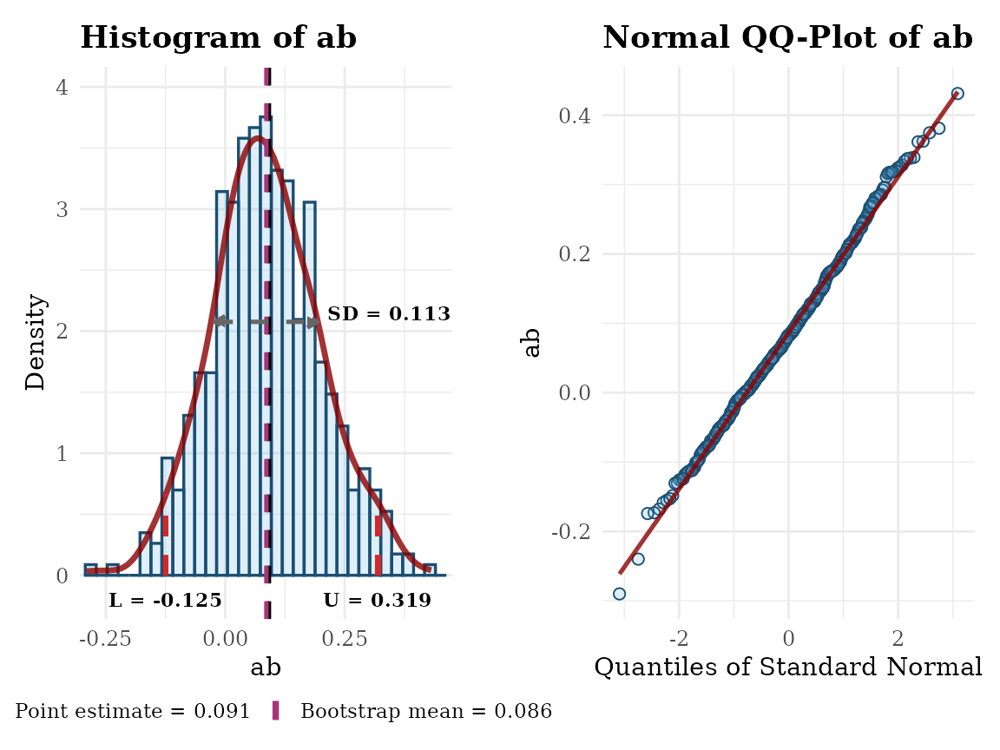
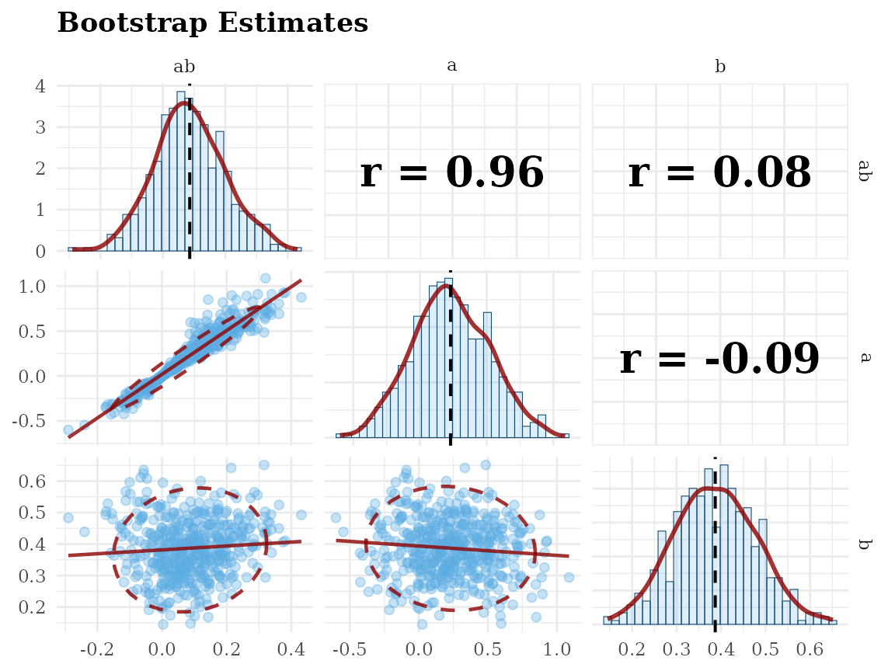
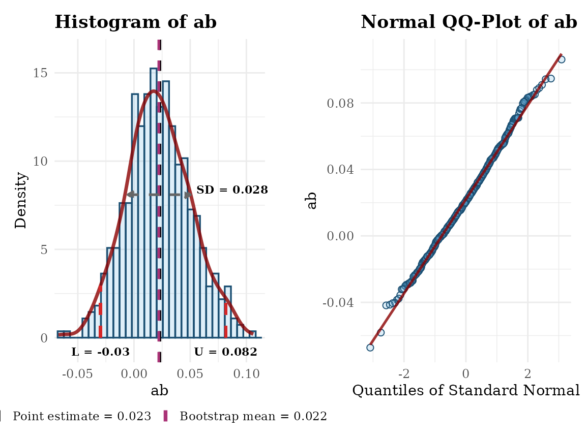
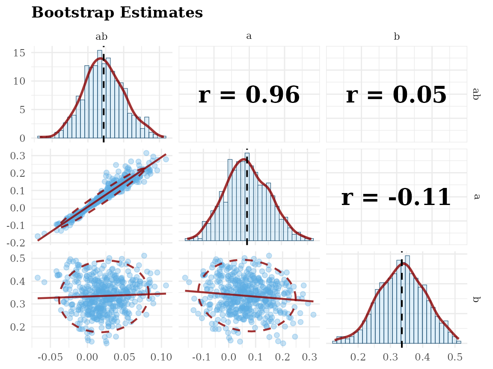

# gg_hist_qq_boot_and_gg_scatter_boot

## Overview

This vignette demonstrates two `ggplot2`-based utilities for visualizing
bootstrap estimates stored/returned by
[`semboottools`](https://yangzhen1999.github.io/semboottools/) ([Yang &
Cheung, 2026](#ref-yang_forming_2026)):

- [`gg_hist_qq_boot()`](https://Yangzhen1999.github.io/semboottools/reference/gg_hist_qq_boot.md):
  modular histogram/density with optional confidence intervals (CIs),
  mean/boot-mean lines, SD arrow, and a side-by-side QQ plot.
- [`gg_scatter_boot()`](https://Yangzhen1999.github.io/semboottools/reference/gg_scatter_boot.md):
  a scatterplot matrix (via **GGally**) for multiple parameters’
  bootstrap draws.

Compared to base plots, these functions are **modern** (*ggplot2*) and
**modular** (optional layers), and can **return the `ggplot` objects**
for further customization.

The following packages will be used:

``` r
library(semboottools)
library(lavaan)
#> This is lavaan 0.6-21
#> lavaan is FREE software! Please report any bugs.
```

## Example

``` r
library(lavaan)

# Simulate data
set.seed(1234)
n <- 200
x <- runif(n) - 0.5
m <- 0.4 * x + rnorm(n)
y <- 0.3 * m + rnorm(n)
dat <- data.frame(x, m, y)

# Specify model
model <- '
  m ~ a * x
  y ~ b * m + cp * x
  ab := a * b
'

# Fit model
fit0 <- sem(model, data = dat, fixed.x = FALSE)

# Store bootstrap draws
# `R`, the number of bootstrap samples, should be ≥2000 in real studies.
# `parallel` should be used unless fitting the model is fast.
# Set `ncpus` to a larger value or omit it in real studies.
# `iseed` is set to make the results reproducible.

fit2 <- store_boot(
  fit0,
  R = 500,
  iseed = 2345,
  parallel = "snow",
  ncpus = 2)
```

### Basic Usage: Default Settings

Visualizing the bootstrap estimates for the unstandardized solution:

``` r
gg_hist_qq_boot(fit2,
                param = "ab",
                standardized = FALSE)
#> Warning: Removed 2 rows containing missing values or values outside the scale range
#> (`geom_bar()`).
```



``` r
gg_scatter_boot(fit2,
                param = c("ab", "a", "b"),
                standardized = FALSE)
```



Visualizing the bootstrap estimates for the standardized solution:

``` r
gg_hist_qq_boot(fit2,
                param = "ab",
                standardized = TRUE)
#> Warning: Removed 2 rows containing missing values or values outside the scale range
#> (`geom_bar()`).
```



``` r
gg_scatter_boot(fit2,
                param = c("ab", "a", "b"),
                standardized = TRUE)
```



## Reference(s)

Yang, W., & Cheung, S. F. (2026). Forming bootstrap confidence intervals
and examining bootstrap distributions of standardized coefficients in
structural equation modelling: A simplified workflow using the R package
semboottools. *Behavior Research Methods*, *58*(2), 38.
<https://doi.org/10.3758/s13428-025-02911-z>
