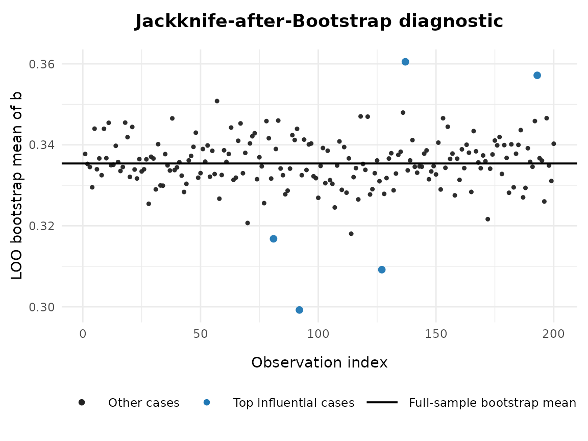
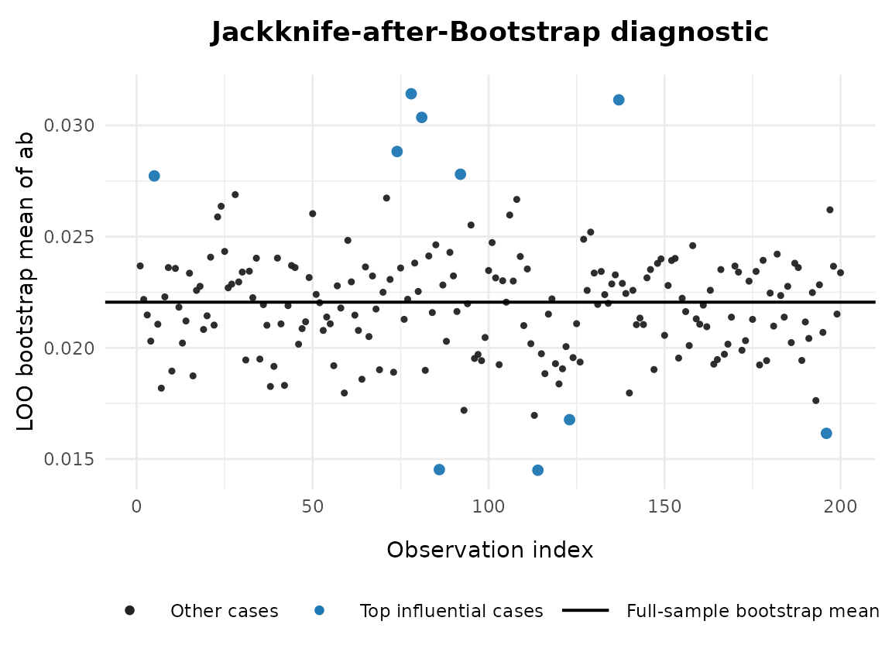

# jab_after_boot

## Overview

This vignette demonstrates how to use
[`jab_after_boot()`](https://Yangzhen1999.github.io/semboottools/reference/jab_after_boot.md)
in the package
[`semboottools`](https://yangzhen1999.github.io/semboottools/) ([Yang &
Cheung, 2026](#ref-yang_forming_2026)) to compute
**Jackknife-after-Bootstrap (JAB)** influence values ([Efron &
Tibshirani, 1993](#ref-efron_introduction_1993)) for a single model
parameter from a `lavaan` model fitted with stored bootstrap replicates
(including `boot.idx`). The function summarizes the full bootstrap
distribution and the leave-one-out (LOO) subdistributions, ranks
influential observations, and (optionally) plots a diagnostic figure.

The following two packages are needed:

``` r
library(semboottools)
library(lavaan)
#> This is lavaan 0.6-21
#> lavaan is FREE software! Please report any bugs.
```

## Arguments

The function
[`jab_after_boot()`](https://Yangzhen1999.github.io/semboottools/reference/jab_after_boot.md)
accepts the following arguments:

| Argument        | Description                                                                                                                                                                                                                                                                                                                       |
|-----------------|-----------------------------------------------------------------------------------------------------------------------------------------------------------------------------------------------------------------------------------------------------------------------------------------------------------------------------------|
| `fit`           | A fitted `lavaan` object for which [`store_boot()`](https://Yangzhen1999.github.io/semboottools/reference/store_boot.md) has been called with `keep.idx = TRUE`. Must contain `fit@external$sbt_boot_ustd` (with `boot.idx` attribute), and typically `fit@external$sbt_boot_std`.                                                |
| `param`         | The target parameter to diagnose. Can be given as (i) `"lhs op rhs"` (e.g., `"Y ~ X"`, `"Y ~~ Y"`, `"X =~ x1"`), (ii) a user-defined `":="` label (e.g., `"ab"`), or (iii) a parameter label (e.g., `"b"`).                                                                                                                       |
| `standardized`  | Logical. If `TRUE`, use standardized bootstrap estimates ([`standardizedSolution_boot()`](https://Yangzhen1999.github.io/semboottools/reference/standardizedSolution_boot.md)); if `FALSE`, use unstandardized ([`parameterEstimates_boot()`](https://Yangzhen1999.github.io/semboottools/reference/parameterEstimates_boot.md)). |
| `top_k`         | Integer. Number of most influential cases (by absolute JAB value) to report in the summary table.                                                                                                                                                                                                                                 |
| `ci_level`      | Numeric between 0 and 1. Confidence level for percentile bootstrap confidence intervals recomputed on each leave-one-out (LOO) subdistribution.                                                                                                                                                                                   |
| `min_keep`      | Integer. Minimum number of bootstrap replicates to retain in each LOO subset. Default is `max(30, floor(0.2 * B))`.                                                                                                                                                                                                               |
| `plot`          | Logical. If `TRUE`, produce a diagnostic plot showing full-sample bootstrap mean and case-deleted bootstrap means.                                                                                                                                                                                                                |
| `plot_engine`   | Character. Choose `"ggplot2"` (default, modern graphics) or `"base"` (basic R graphics) for the plot.                                                                                                                                                                                                                             |
| `ylab_override` | Optional character. Override the default y-axis label in the plot.                                                                                                                                                                                                                                                                |
| `verbose`       | Logical. If `TRUE` (default), print summaries to console (ALL vs. LOO).                                                                                                                                                                                                                                                           |
| `font_family`   | Character. Font family for plotting (default `"serif"`). Use `"sans"` or `"Times New Roman"` for cross-platform robustness.                                                                                                                                                                                                       |

------------------------------------------------------------------------

## Value

The function returns a list with the following components:

| Component       | Description                                                                                                          |
|-----------------|----------------------------------------------------------------------------------------------------------------------|
| `param`         | The target parameter string.                                                                                         |
| `standardized`  | Logical flag indicating whether standardized bootstrap was used.                                                     |
| `full_summary`  | Data frame with the summary statistics (mean, SE, CI) for the full bootstrap distribution (`scope = "ALL"`).         |
| `cases_summary` | Data frame of the top `top_k` cases ranked by absolute JAB influence, with case index, JAB value, and LOO summaries. |
| `F`             | The B × n occurrence matrix (bootstrap replicate by observation).                                                    |
| `tstar`         | Full bootstrap vector for the parameter.                                                                             |
| `plot_obj`      | A `ggplot` object if `plot = TRUE` and `plot_engine = "ggplot2"`, otherwise `NULL`.                                  |

------------------------------------------------------------------------

## Example

``` r
library(lavaan)
# Simulate data
set.seed(1234)
n <- 200
x <- runif(n) - 0.5
m <- 0.4 * x + rnorm(n)
y <- 0.3 * m + rnorm(n)
dat <- data.frame(x, m, y)

# Specify model
model <- '
  m ~ a * x
  y ~ b * m + cp * x
  ab := a * b
'

# Fit model
fit0 <- sem(model,
            data = dat,
            fixed.x = FALSE)

# Store bootstrap draws using `store_boot()`.
# `R`, the number of bootstrap samples, should be ≥2000 in real studies.
# `parallel` should be used unless fitting the model is fast.
# Set `ncpus` to a larger value or omit it in real studies.
# Before calling `jab_after_boot()`, you **must** re-run the model with store_boot(keep.idx = TRUE).  This is crucial: without `keep.idx = TRUE`, the bootstrap index matrix (boot.idx) will not be saved, and JAB cannot compute leave-one-out subdistributions.

fit2 <- store_boot(
          fit0,
          R = 500,
          ncpus = 2,
          iseed = 2345,
          keep.idx = TRUE,
          parallel = "snow"
        )
```

When you run
[`jab_after_boot()`](https://Yangzhen1999.github.io/semboottools/reference/jab_after_boot.md)
with `verbose = TRUE`, two blocks of output are shown:

1.  **Full-sample bootstrap summary (ALL)**  
    This block reports the overall bootstrap distribution of the chosen
    parameter across all bootstrap replicates. It includes the bootstrap
    mean, the standard error (SE), and the percentile confidence
    interval. These values are consistent with what you would obtain
    from
    [`standardizedSolution_boot()`](https://Yangzhen1999.github.io/semboottools/reference/standardizedSolution_boot.md)
    or
    [`parameterEstimates_boot()`](https://Yangzhen1999.github.io/semboottools/reference/parameterEstimates_boot.md)
    without JAB. In other words, it is the reference point against which
    the leave-one-out results are compared.

2.  **Leave-one-out (LOO) summaries**  
    This block lists the top `top_k` most influential cases, ranked by
    the absolute JAB influence statistic. For each case, it shows:

- **JAB_value**: the influence index
  $$I_{j} = n({\bar{\theta}}_{( - j)} - \bar{\theta})$$ Large positive
  values mean that excluding the case increases the bootstrap mean;
  large negative values mean it decreases the bootstrap mean.
- **mean, SE, CI.Lo, CI.Up**: the bootstrap mean, standard error, and
  confidence interval recomputed when this case is excluded from the
  resampling. By comparing these numbers to the full-sample summary, you
  can diagnose which individual observations exert the strongest
  influence on the bootstrap results.

The diagnostic plot visualizes the same information:

- **Black points**: leave-one-out bootstrap means for each observation.

- **Blue points**: the most influential cases (top `top_k` by absolute
  JAB value).

- **Horizontal line**: the full-sample bootstrap mean, serving as the
  reference. If a case is highly influential, its corresponding point
  will be far away from the horizontal line. The plot therefore provides
  an intuitive complement to the numeric summaries shown above.

``` r
# Run JAB analysis for b
res1 <- semboottools::jab_after_boot(
  fit2,
  param        = "b",
  standardized = TRUE,
  top_k        = 5,
  plot         = TRUE,
  plot_engine  = "ggplot2",
  font_family  = "sans"
)
#> Warning in standardizedSolution_boot(fit): The number of bootstrap samples
#> (500) is less than 'boot_pvalue_min_size' (1000). Bootstrap p-values are not
#> computed.
#> 
#> === Full-sample bootstrap summary (ALL) ===
#>  scope param      mean         SE     CI.Lo     CI.Up
#>    ALL     b 0.3353919 0.07295324 0.1882437 0.4732442
#> 
#> === Leave-one-out (LOO) summaries ===
#>  case JAB_value      mean         SE     CI.Lo     CI.Up
#>    92 -7.236989 0.2992069 0.06719392 0.1601469 0.4404296
#>   127 -5.245944 0.3091622 0.07280845 0.1738193 0.4557513
#>   137  5.022650 0.3605051 0.07053184 0.2181614 0.4885032
#>   193  4.354088 0.3571623 0.06866697 0.2336293 0.4726764
#>    81 -3.720797 0.3167879 0.07265659 0.1599793 0.4421728
```



``` r

# Run JAB analysis for ab
res2 <- semboottools::jab_after_boot(
  fit2,
  param        = "ab",
  standardized = TRUE,
  top_k        = 10,
  plot         = TRUE
)
#> Warning in standardizedSolution_boot(fit): The number of bootstrap samples
#> (500) is less than 'boot_pvalue_min_size' (1000). Bootstrap p-values are not
#> computed.
#> 
#> === Full-sample bootstrap summary (ALL) ===
#>  scope param       mean         SE       CI.Lo      CI.Up
#>    ALL    ab 0.02205182 0.02836564 -0.03085612 0.08256031
#> 
#> === Leave-one-out (LOO) summaries ===
#>  case JAB_value       mean         SE       CI.Lo      CI.Up
#>    78  1.873696 0.03142030 0.02904378 -0.02800619 0.08832053
#>   137  1.818879 0.03114621 0.02997415 -0.02577827 0.08691811
#>    81  1.660960 0.03035662 0.02688429 -0.01906004 0.08456067
#>   114 -1.510883 0.01449740 0.02490139 -0.03477090 0.06215709
#>    86 -1.505124 0.01452620 0.02802819 -0.03009688 0.06687608
#>    74  1.354431 0.02882397 0.02732577 -0.02041622 0.08386695
#>   196 -1.179388 0.01615488 0.02713066 -0.03780784 0.07084059
#>    92  1.150002 0.02780183 0.02605886 -0.01506608 0.08439113
#>     5  1.134956 0.02772660 0.02609942 -0.01818235 0.08226761
#>   123 -1.056503 0.01676930 0.02749477 -0.03331698 0.07272497
```



## References

Efron, B., & Tibshirani, R. (1993). *An Introduction to the bootstrap*.
Chapman & Hall/CRC.

Yang, W., & Cheung, S. F. (2026). Forming bootstrap confidence intervals
and examining bootstrap distributions of standardized coefficients in
structural equation modelling: A simplified workflow using the R package
semboottools. *Behavior Research Methods*, *58*(2), 38.
<https://doi.org/10.3758/s13428-025-02911-z>
