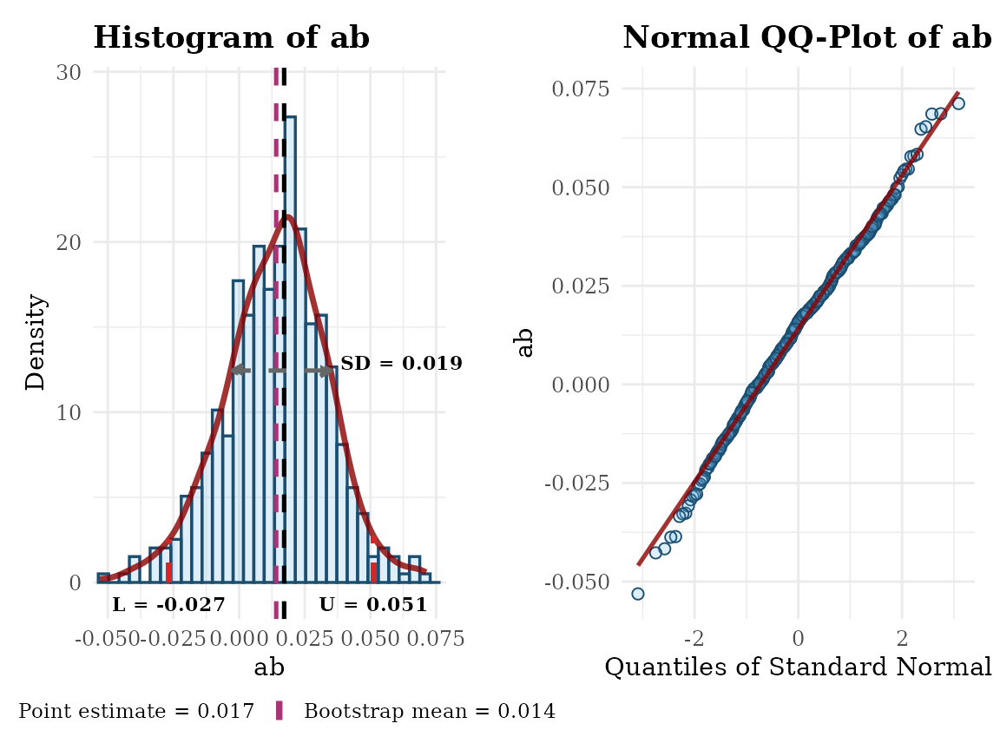
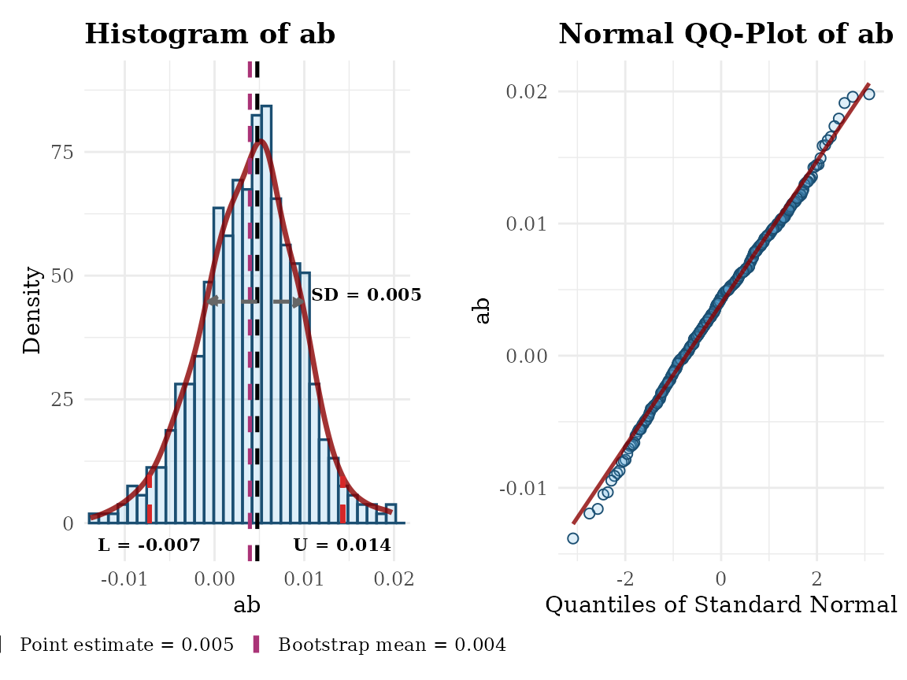
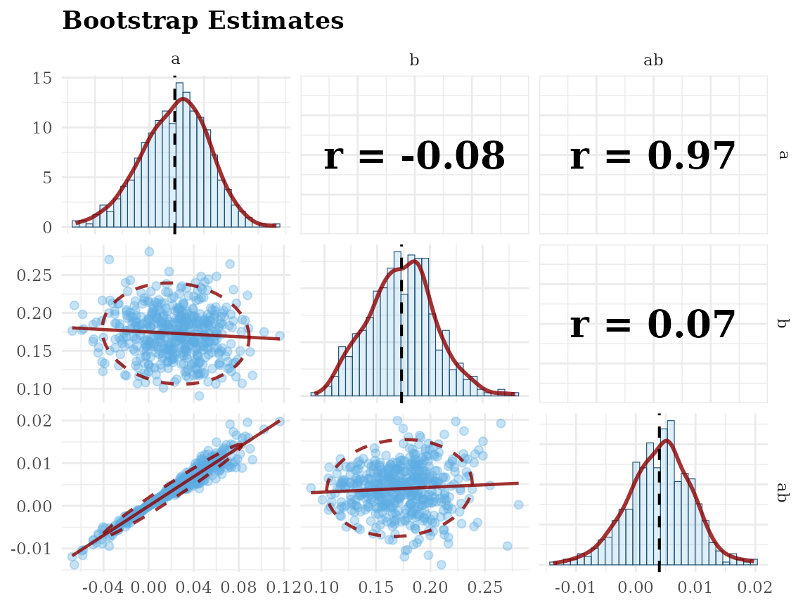
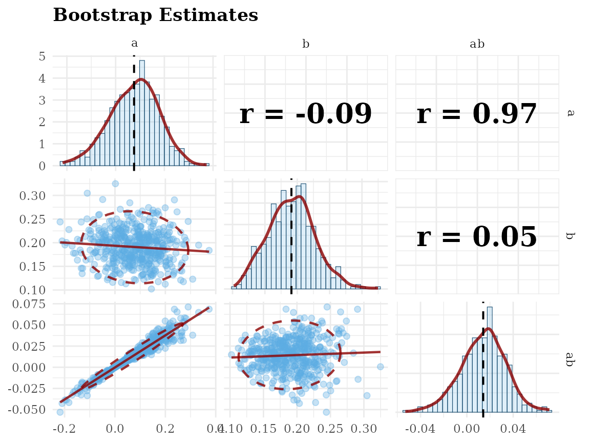

# semboottools

## Overview

This vignette demonstrates how to form bootstrapping confidence
intervals and examining bootstrap estimates in SEM using
[`semboottools`](https://yangzhen1999.github.io/semboottools/),
described in Yang & Cheung ([2026](#ref-yang_forming_2026)).

The following packages will be used:

``` r
library(semboottools)
library(lavaan)
#> This is lavaan 0.6-21
#> lavaan is FREE software! Please report any bugs.
```

## Example: Simple Mediation Model

We use a simple mediation model with a large sample (N = 1000) for
demonstration.

This model includes: A predictor `x`, A mediator `m`, An outcome `y`.

Indirect effect (`ab`) and total effect (`total`) are defined below.

``` r
# Set seed for reproducibility
set.seed(1234)

# Generate data
n <- 1000
x <- runif(n) - 0.5
m <- 0.20 * x + rnorm(n)
y <- 0.17 * m + rnorm(n)
dat <- data.frame(x, y, m)

# Specify mediation model in lavaan syntax
mod <- '
  m ~ a * x
  y ~ b * m + cp * x
  ab := a * b
  total := a * b + cp
'
```

### Fit the Model with Bootstrapping

Suppose we fit the model using the default method for standard errors
and confidence intervals for model parameter:

``` r
fit <- sem(mod,
           data = dat,
           fixed.x = FALSE)
summary(fit,
        ci = TRUE)
#> lavaan 0.6-21 ended normally after 6 iterations
#> 
#>   Estimator                                         ML
#>   Optimization method                           NLMINB
#>   Number of model parameters                         6
#> 
#>   Number of observations                          1000
#> 
#> Model Test User Model:
#>                                                       
#>   Test statistic                                 0.000
#>   Degrees of freedom                                 0
#> 
#> Parameter Estimates:
#> 
#>   Standard errors                             Standard
#>   Information                                 Expected
#>   Information saturated (h1) model          Structured
#> 
#> Regressions:
#>                    Estimate  Std.Err  z-value  P(>|z|) ci.lower ci.upper
#>   m ~                                                                   
#>     x          (a)    0.089    0.103    0.867    0.386   -0.113    0.291
#>   y ~                                                                   
#>     m          (b)    0.192    0.034    5.578    0.000    0.125    0.260
#>     x         (cp)   -0.018    0.112   -0.162    0.871   -0.238    0.202
#> 
#> Variances:
#>                    Estimate  Std.Err  z-value  P(>|z|) ci.lower ci.upper
#>    .m                 0.898    0.040   22.361    0.000    0.819    0.977
#>    .y                 1.065    0.048   22.361    0.000    0.972    1.159
#>     x                 0.085    0.004   22.361    0.000    0.077    0.092
#> 
#> Defined Parameters:
#>                    Estimate  Std.Err  z-value  P(>|z|) ci.lower ci.upper
#>     ab                0.017    0.020    0.857    0.392   -0.022    0.056
#>     total            -0.001    0.114   -0.009    0.993   -0.224    0.222
```

For the indirect effect, we would like to use bootstrap confidence
intervals. Instead of refitting the model, we can call
[`store_boot()`](https://Yangzhen1999.github.io/semboottools/reference/store_boot.md)
to do bootstrapping, and add the bootstrap estimates to the the original
output. The original object can be safely overwritten.

``` r
# Ensure bootstrap estimates are stored
# `R`, the number of bootstrap samples, should be ≥2000 in real studies.
# `parallel` should be used unless fitting the model is fast.
# Set `ncpus` to a larger value or omit it in real studies.
# `iseed` is set to make the results reproducible.
fit <- store_boot(fit,
                  R = 500,
                  parallel = "snow",
                  ncpus = 2,
                  iseed = 1248)
```

### Form Bootstrap CIs for Standardized Coefficients

``` r
# Basic usage: default settings
# Compute standardized solution with percentile bootstrap CIs
std_boot <- standardizedSolution_boot(fit)
#> Warning in standardizedSolution_boot(fit): The number of bootstrap samples
#> (500) is less than 'boot_pvalue_min_size' (1000). Bootstrap p-values are not
#> computed.
print(std_boot)
#> 
#> Bootstrapping:
#>                                     
#>  Valid Bootstrap Samples: 500       
#>  Level of Confidence:     95.0%     
#>  CI Type:                 Percentile
#>  Standardization Type:    std.all   
#> 
#> Parameter Estimates Settings:
#>                                              
#>  Standard errors:                  Standard  
#>  Information:                      Expected  
#>  Information saturated (h1) model: Structured
#> 
#> Regressions:
#>                   Std    SE     p  CI.Lo CI.Up   bSE bCI.Lo bCI.Up
#>  m ~                                                              
#>   x (a)         0.027 0.032 0.386 -0.035 0.089 0.031 -0.041  0.078
#>  y ~                                                              
#>   m (b)         0.174 0.031 0.000  0.114 0.234 0.031  0.115  0.237
#>   x (cp)       -0.005 0.031 0.871 -0.066 0.056 0.031 -0.063  0.057
#> 
#> Variances:
#>                   Std    SE     p  CI.Lo CI.Up   bSE bCI.Lo bCI.Up
#>   .m            0.999 0.002 0.000  0.996 1.003 0.002  0.994  1.000
#>   .y            0.970 0.011 0.000  0.949 0.991 0.011  0.943  0.986
#>    x            1.000                                             
#> 
#> Defined Parameters:
#>                   Std    SE     p  CI.Lo CI.Up   bSE bCI.Lo bCI.Up
#>  ab (ab)        0.005 0.006 0.391 -0.006 0.016 0.005 -0.008  0.014
#>  total (total) -0.000 0.032 0.993 -0.062 0.062 0.031 -0.058  0.059
#> 
#> Footnote:
#> - Std: Standardized estimates.
#> - SE: Delta method standard errors.
#> - p: Delta method p-values.
#> - CI.Lo, CI.Up: Delta method confidence intervals.
#> - bSE: Bootstrap standard errors.
#> - bCI.Lo, bCI.Up: Bootstrap confidence intervals.
```

### Form Bootstrap CIs for Unstandardized Coefficients

Although the main feature is for the standardized solution, the
[`parameterEstimates_boot()`](https://Yangzhen1999.github.io/semboottools/reference/parameterEstimates_boot.md)
can be used to compute bootstrap CIs, standard errors, and optional
asymmetric *p*-values for unstandardized parameter estimates, including
both free and user-defined parameters, when bootstrapping is conducted
by
[`store_boot()`](https://Yangzhen1999.github.io/semboottools/reference/store_boot.md).

It requires bootstrap estimates stored via
[`store_boot()`](https://Yangzhen1999.github.io/semboottools/reference/store_boot.md),
supports percentile and bias-corrected CIs, and outputs bootstrap SEs as
the standard deviation of estimates.

``` r
# Basic usage: default settings
# Compute unstandardized solution with percentile bootstrap CIs
est_boot <- parameterEstimates_boot(fit)
#> Warning in parameterEstimates_boot(fit): The number of bootstrap samples (500)
#> is less than 'boot_pvalue_min_size' (1000). Bootstrap p-values are not
#> computed.

# Print results
print(est_boot)
#> 
#> Bootstrapping:
#>                                     
#>  Valid Bootstrap Samples: 500       
#>  Level of Confidence:     95.0%     
#>  CI Type:                 Percentile
#> 
#> Parameter Estimates Settings:
#>                                              
#>  Standard errors:                  Standard  
#>  Information:                      Expected  
#>  Information saturated (h1) model: Structured
#> 
#> Regressions:
#>                Estimate    SE     p  CI.Lo CI.Up   bSE bCI.Lo bCI.Up
#>  m ~                                                                
#>   x (a)           0.089 0.103 0.386 -0.113 0.291 0.100 -0.136  0.264
#>  y ~                                                                
#>   m (b)           0.192 0.034 0.000  0.125 0.260 0.036  0.123  0.264
#>   x (cp)         -0.018 0.112 0.871 -0.238 0.202 0.112 -0.228  0.205
#> 
#> Variances:
#>                Estimate    SE     p  CI.Lo CI.Up   bSE bCI.Lo bCI.Up
#>   .m              0.898 0.040 0.000  0.819 0.977 0.038  0.829  0.970
#>   .y              1.065 0.048 0.000  0.972 1.159 0.046  0.972  1.147
#>    x              0.085 0.004 0.000  0.077 0.092 0.002  0.080  0.090
#> 
#> Defined Parameters:
#>                Estimate    SE     p  CI.Lo CI.Up   bSE bCI.Lo bCI.Up
#>  ab (ab)          0.017 0.020 0.392 -0.022 0.056 0.019 -0.028  0.053
#>  total (total)   -0.001 0.114 0.993 -0.224 0.222 0.113 -0.211  0.213
#> 
#> Footnote:
#> - SE: Original standard errors.
#> - p: Original p-values.
#> - CI.Lo, CI.Up: Original confidence intervals.
#> - bSE: Bootstrap standard errors.
#> - bCI.Lo, bCI.Up: Bootstrap confidence intervals.
```

### Visualize Bootstrap Estimates

To examine the distribution of bootstrap estimates, two functions are
available:

- [`hist_qq_boot()`](https://Yangzhen1999.github.io/semboottools/reference/hist_qq_boot.md)  
  For histogram + normal QQ-plot of **one parameter**.

- [`scatter_boot()`](https://Yangzhen1999.github.io/semboottools/reference/hist_qq_boot.md)  
  For scatterplot matrix of **two or more parameters**.

#### Histogram and QQ Plot: `hist_qq_boot()`

``` r
# For estimates of user-defined parameters,
# unstandardized
gg_hist_qq_boot(fit,
                param = "ab",
                standardized = FALSE)
#> Warning: Removed 2 rows containing missing values or values outside the scale range
#> (`geom_bar()`).
```



``` r
# For estimates in standardized solution,
gg_hist_qq_boot(fit,
                param = "ab",
                standardized = TRUE)
#> Warning: Removed 2 rows containing missing values or values outside the scale range
#> (`geom_bar()`).
```



#### Scatterplot Matrix: `scatter_boot()`

``` r
# standardized solution
gg_scatter_boot(fit,
                param = c("a", "b", "ab"),
                standardized = TRUE)
```



``` r
# unstandardized solution
gg_scatter_boot(fit,
                param = c("a", "b", "ab"),
                standardized = FALSE)
```



### Reference(s)

Yang, W., & Cheung, S. F. (2026). Forming bootstrap confidence intervals
and examining bootstrap distributions of standardized coefficients in
structural equation modelling: A simplified workflow using the R package
semboottools. *Behavior Research Methods*, *58*(2), 38.
<https://doi.org/10.3758/s13428-025-02911-z>
